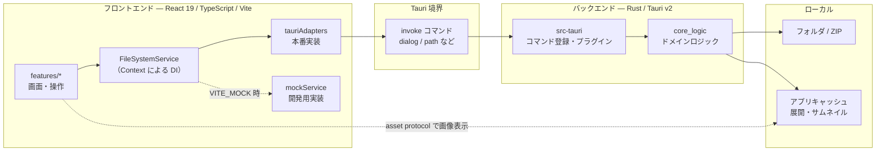

#  sun-riseup-viewrrr

sun-riseup-viewrrr は、漫画・イラストコレクション向けのクロスプラットフォーム画像ビューアです。

自分が求める閲覧体験を実現するため、Tauri v2 上でフロントエンド（React）とバックエンド（Rust）を組み合わせて開発しています。

---

## 主な機能

- フォルダおよび ZIP アーカイブ内の画像閲覧
- 同じ階層にあるフォルダ・アーカイブの一覧とサムネイル表示
- キーボードショートカットによるページ送りと操作
- ライト / ダークテーマの切り替え

## システム構成

フロントエンドとバックエンドのつながりが分かる粒度でまとめています。個々の機能の設計はここでは扱いません。

### 全体像



### レイヤの役割

| レイヤ | 主な置き場 | 役割 |
| --- | --- | --- |
| UI | `src/features/` | 画面と操作（シェル / フォルダナビゲーション / 画像ビューア） |
| フロント境界 | `src/shared/` | `FileSystemService` の契約と DI、Tauri API のアダプタ |
| Tauri シェル | `src-tauri/` | コマンド登録、プラグイン、キャッシュパスの解決 |
| ドメイン | `src-tauri/core_logic/` | Tauri に依存しないファイル走査・アーカイブ読取・サムネイル生成 |
| ローカル資源 | OS のファイルシステム | 画像本体と、アーカイブ展開・サムネイルのキャッシュ |

ポイントは次の 3 点です。

- フロントエンドとバックエンドの通信は `invoke` によるコマンド呼び出しが中心です。UI は `FileSystemService` を介して呼ぶため、Tauri API に直接依存しません。
- 重い処理は Rust 側に寄せています。フォルダや ZIP の走査、サムネイル生成は `core_logic` が担い、`src-tauri` は薄いラッパに留めています。
- 開発時は同じ契約のモック実装に差し替えられるため、Rust バックエンドなしでもブラウザだけで UI を確認できます。

### 技術スタック

| 領域 | 技術 |
| --- | --- |
| UI | React 19, TypeScript, Vite, Tailwind CSS, SWR |
| デスクトップ | Tauri v2（dialog / fs / log などのプラグイン） |
| バックエンド | Rust（Tauri シェル + `core_logic` クレート） |
| 品質 | Biome, Vitest, `cargo test` |

### ディレクトリ構成（抜粋）

```text
.
├── src/                      # フロントエンド
│   ├── features/             # 画面・機能単位
│   ├── shared/               # アダプタ・DI・共通フック
│   └── dev/                  # 開発用モック実装
├── src-tauri/                # Tauri シェル（コマンド・プラグイン）
│   └── core_logic/           # ドメインロジック（Tauri 非依存）
├── tests/                    # テスト・モック共用のフィクスチャ
└── docs/                     # 設計メモ・ADR
```

---

## 推奨 IDE 設定

- [VS Code](https://code.visualstudio.com/) + [Tauri](https://marketplace.visualstudio.com/items?itemName=tauri-apps.tauri-vscode) + [rust-analyzer](https://marketplace.visualstudio.com/items?itemName=rust-lang.rust-analyzer)

## 前提条件

- Node.js 22 以上と pnpm
- Rust ツールチェイン（stable）
- OS ごとの依存パッケージは、Tauri 公式ドキュメントを参照してください  
  [https://v2.tauri.app/start/prerequisites/](https://v2.tauri.app/start/prerequisites/)

## ビルド・開発手順

1. **依存関係のインストール**

    ```bash
    pnpm install
    ```

2. **開発モードで起動**

    ```bash
    pnpm tauri dev
    ```

    UI だけをブラウザで確認する場合は、モックモードを使用します。

    ```bash
    pnpm dev:mock
    ```

3. **本番ビルド**

    ```bash
    pnpm tauri build
    ```

## 開発時のコマンド

```bash
pnpm lint                          # Biome によるチェック
pnpm test                          # フロントエンドのテスト（Vitest）
cd src-tauri && cargo test --workspace  # Rust のテスト
```
