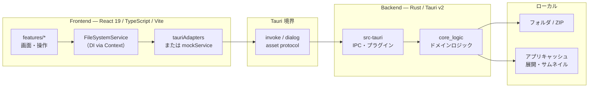

#  sun-riseup-viewrrr

sun-riseup-viewrrr は、漫画・イラストコレクション向けのクロスプラットフォーム画像ビューアです。

個人として求めている閲覧体験を実現するため、Tauri v2 上でフロントエンド（React）とバックエンド（Rust）を組み合わせて開発しています。

---

## システム構成

採用側・閲覧者向けに、**フロントとバックエンドのつながりがざっくり分かる粒度**で記載しています。個々の機能設計は頻繁に変わるため、ここでは扱いません。

### 全体像



### レイヤの役割

| レイヤ | 主な置き場 | 役割 |
| --- | --- | --- |
| UI | `src/features/` | 画面と操作（シェル / フォルダナビ / 画像ビューア） |
| フロント境界 | `src/shared/` | `FileSystemService` 契約と DI。本番は Tauri アダプタ、開発時はモック差し替え可 |
| Tauri シェル | `src-tauri/` | `invoke` コマンド登録、プラグイン、キャッシュパス解決 |
| ドメイン | `src-tauri/core_logic/` | Tauri 非依存の FS・アーカイブ読取・サムネイル処理 |
| ローカル資源 | OS ファイルシステム | 画像本体と、展開/サムネイル用キャッシュ |

ポイントだけ抜くと次のとおりです。

- **通信は主に `invoke`（コマンド呼び出し）**。フロントはサービス抽象経由で呼ぶため、UI が Tauri API に直接べったりしない。
- **重い処理は Rust 側**。フォルダ / ZIP の列挙やサムネイル生成は `core_logic` に寄せ、シェルは薄いラッパにする。
- **開発時は `pnpm dev:mock`** で同一のサービス契約をモック実装に差し替え、ブラウザだけで UI を起動できる。

### 技術スタック（概要）

| 領域 | 技術 |
| --- | --- |
| UI | React 19, TypeScript, Vite, Tailwind CSS, SWR |
| Desktop | Tauri v2（dialog / path / log など） |
| Backend | Rust（`core_logic` crate + Tauri シェル） |
| Quality | Biome, Vitest, Cargo test |

### ディレクトリ構成（抜粋）

```text
.
├── src/                      # フロントエンド
│   ├── features/             # 画面・機能単位
│   ├── shared/               # アダプタ・DI・共通フック
│   └── dev/                  # モック実装（VITE_MOCK）
├── src-tauri/                # Tauri シェル（IPC・プラグイン）
│   └── core_logic/           # ドメインロジック（Tauri 非依存）
├── tests/                    # モック用フィクスチャなど
└── docs/                     # 設計メモ・ADR（実行には不要）
```

---

## Recommended IDE Setup

- [VS Code](https://code.visualstudio.com/) + [Tauri](https://marketplace.visualstudio.com/items?itemName=tauri-apps.tauri-vscode) + [rust-analyzer](https://marketplace.visualstudio.com/items?itemName=rust-lang.rust-analyzer)

## Prerequisites

Please refer to the official Tauri documentation for the prerequisites specific to your operating system:
[https://v2.tauri.app/start/prerequisites/](https://v2.tauri.app/start/prerequisites/)

## How to Build or Develop

1. **Install Dependencies:**

    ```bash
    pnpm install
    ```

2. **Run in Development Mode:**

    ```bash
    pnpm tauri dev
    ```

    UI だけブラウザで確認する場合:

    ```bash
    pnpm dev:mock
    ```

3. **Build for Production:**

    ```bash
    pnpm tauri build
    ```
