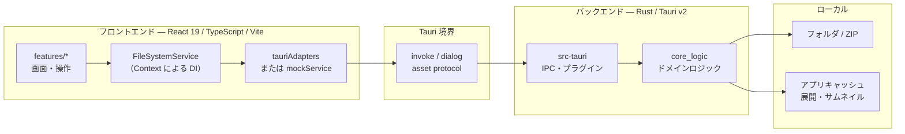

#  sun-riseup-viewrrr

sun-riseup-viewrrr は、漫画・イラストコレクション向けのクロスプラットフォーム画像ビューアです。

自分が求める閲覧体験を実現するため、Tauri v2 上でフロントエンド（React）とバックエンド（Rust）を組み合わせて開発しています。

---

## システム構成

フロントとバックエンドのつながりがざっくり分かる粒度で記載しています。個々の機能設計はここでは扱いません。

### 全体像



### レイヤの役割

| レイヤ | 主な置き場 | 役割 |
| --- | --- | --- |
| UI | `src/features/` | 画面と操作（シェル / フォルダナビ / 画像ビューア） |
| フロント境界 | `src/shared/` | `FileSystemService` の契約と DI。本番は Tauri アダプタ、開発時はモックに差し替え可能 |
| Tauri シェル | `src-tauri/` | `invoke` コマンドの登録、プラグイン、キャッシュパスの解決 |
| ドメイン | `src-tauri/core_logic/` | Tauri に依存しない FS・アーカイブ読取・サムネイル処理 |
| ローカル資源 | OS のファイルシステム | 画像本体と、展開・サムネイル用キャッシュ |

補足です。

- 通信は主に `invoke`（コマンド呼び出し）です。フロントはサービス抽象経由で呼ぶため、UI が Tauri API に直接依存しません。
- 重い処理は Rust 側に寄せています。フォルダ / ZIP の列挙やサムネイル生成は `core_logic` が担い、シェルは薄いラッパです。
- 開発時は `pnpm dev:mock` で同じサービス契約をモック実装に差し替え、ブラウザだけで UI を起動できます。

### 技術スタック（概要）

| 領域 | 技術 |
| --- | --- |
| UI | React 19, TypeScript, Vite, Tailwind CSS, SWR |
| デスクトップ | Tauri v2（dialog / path / log など） |
| バックエンド | Rust（`core_logic` crate + Tauri シェル） |
| 品質 | Biome, Vitest, Cargo test |

### ディレクトリ構成（抜粋）

```text
.
├── src/                      # フロントエンド
│   ├── features/             # 画面・機能単位
│   ├── shared/               # アダプタ・DI・共通フック
│   └── dev/                  # モック実装（VITE_MOCK）
├── src-tauri/                # Tauri シェル（IPC・プラグイン）
│   └── core_logic/           # ドメインロジック（Tauri 非依存）
├── tests/                    # モック用フィクスチャなど
└── docs/                     # 設計メモ・ADR（実行には不要）
```

---

## 推奨 IDE 設定

- [VS Code](https://code.visualstudio.com/) + [Tauri](https://marketplace.visualstudio.com/items?itemName=tauri-apps.tauri-vscode) + [rust-analyzer](https://marketplace.visualstudio.com/items?itemName=rust-lang.rust-analyzer)

## 前提条件

OS ごとの前提条件は、Tauri 公式ドキュメントを参照してください。  
[https://v2.tauri.app/start/prerequisites/](https://v2.tauri.app/start/prerequisites/)

## ビルド・開発手順

1. **依存関係のインストール**

    ```bash
    pnpm install
    ```

2. **開発モードで起動**

    ```bash
    pnpm tauri dev
    ```

    UI だけをブラウザで確認する場合:

    ```bash
    pnpm dev:mock
    ```

3. **本番ビルド**

    ```bash
    pnpm tauri build
    ```
