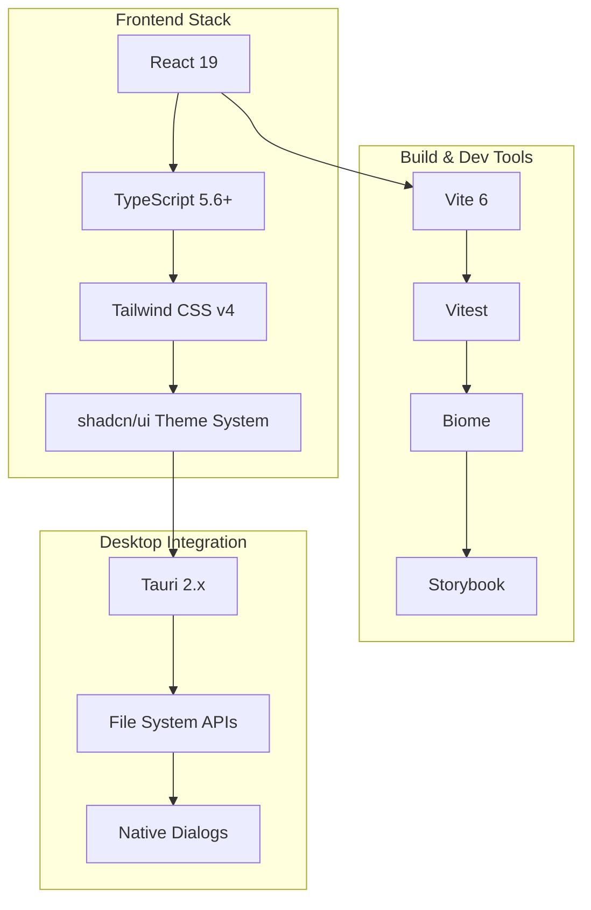

# Design Document

## Overview

このドキュメントでは、sun-riseup-viewrrrアプリケーションを最新の技術スタックにアップグレードするための設計を詳述します。React 19、Tailwind CSS v4、shadcn/uiの統合により、現在の煩雑な設定を簡素化し、開発体験を向上させます。

## Architecture

### Current State Analysis

**現在の構成:**

- React 18.3.1 + TypeScript
- Tailwind CSS v4.1.6 (既に最新版)
- Vite 6.0.3 + Tauri 2.x
- shadcn/ui 0.0.4
- Vitest + Testing Library

**現在の課題:**

- React 19の新機能が利用できない
- テーマ設定が分散している
- 開発ツールの設定が複雑
- 依存関係の管理が煩雑

### Target Architecture



## Components and Interfaces

### 1. React 19 Migration Strategy

**Upgrade Path:**

```typescript
// Before (React 18)
import { useState, useEffect } from 'react';

// After (React 19)
import { useState, useEffect, use } from 'react';
// New concurrent features and improved hooks
```

**Key Changes:**

- New `use` hook for data fetching
- Improved concurrent rendering
- Better TypeScript integration
- Enhanced error boundaries

### 2. Tailwind CSS v4 Configuration

**New Configuration Structure:**

```typescript
// tailwind.config.ts (v4 optimized)
import type { Config } from "tailwindcss";

export default {
  content: ["./src/**/*.{ts,tsx}", "./index.html"],
  theme: {
    extend: {
      // CSS variables integration
      colors: {
        background: "var(--background)",
        foreground: "var(--foreground)",
        // ... other theme colors
      }
    }
  },
  plugins: []
} satisfies Config;
```

**CSS Variables System:**

```css
/* src/styles/themes.css */
@layer base {
  :root {
    /* Light theme variables */
    --background: oklch(1 0 0);
    --foreground: oklch(0.145 0 0);
    /* ... */
  }
  
  .dark {
    /* Dark theme variables */
    --background: oklch(0.145 0 0);
    --foreground: oklch(0.985 0 0);
    /* ... */
  }
}
```

### 3. Unified Theme System

**Theme Provider Architecture:**

```typescript
// src/providers/ThemeProvider.tsx
interface ThemeContextType {
  theme: 'light' | 'dark' | 'system';
  setTheme: (theme: 'light' | 'dark' | 'system') => void;
  resolvedTheme: 'light' | 'dark';
}

export const ThemeProvider: React.FC<{children: React.ReactNode}> = ({children}) => {
  // Theme management logic
  return (
    <ThemeContext.Provider value={contextValue}>
      {children}
    </ThemeContext.Provider>
  );
};
```

**shadcn/ui Integration:**

```typescript
// src/components/ui/theme-toggle.tsx
import { Moon, Sun } from "lucide-react";
import { Button } from "@/components/ui/button";
import { useTheme } from "@/providers/ThemeProvider";

export function ThemeToggle() {
  const { theme, setTheme } = useTheme();
  
  return (
    <Button
      variant="outline"
      size="icon"
      onClick={() => setTheme(theme === "light" ? "dark" : "light")}
    >
      <Sun className="h-[1.2rem] w-[1.2rem] rotate-0 scale-100 transition-all dark:-rotate-90 dark:scale-0" />
      <Moon className="absolute h-[1.2rem] w-[1.2rem] rotate-90 scale-0 transition-all dark:rotate-0 dark:scale-100" />
    </Button>
  );
}
```

## Data Models

### Configuration Management

**Unified Config Structure:**

```typescript
// src/types/config.ts
interface AppConfig {
  theme: {
    mode: 'light' | 'dark' | 'system';
    customColors?: Record<string, string>;
  };
  ui: {
    showControls: boolean;
    autoHideTimeout: number;
    sidebarWidth: number;
  };
  keyboard: {
    shortcuts: Record<string, string>;
  };
}
```

**Settings Persistence:**

```typescript
// src/services/SettingsService.ts
class SettingsService {
  async loadSettings(): Promise<AppConfig> {
    // Load from Tauri store
  }
  
  async saveSettings(config: Partial<AppConfig>): Promise<void> {
    // Save to Tauri store
  }
}
```

## Error Handling

### React 19 Error Boundaries

**Enhanced Error Boundary:**

```typescript
// src/components/ErrorBoundary.tsx
import { ErrorBoundary as ReactErrorBoundary } from 'react';

interface ErrorFallbackProps {
  error: Error;
  resetError: () => void;
}

function ErrorFallback({ error, resetError }: ErrorFallbackProps) {
  return (
    <div className="flex flex-col items-center justify-center min-h-screen p-4">
      <h2 className="text-2xl font-bold text-destructive mb-4">
        Something went wrong
      </h2>
      <pre className="text-sm bg-muted p-4 rounded mb-4 max-w-lg overflow-auto">
        {error.message}
      </pre>
      <Button onClick={resetError}>Try again</Button>
    </div>
  );
}

export function AppErrorBoundary({ children }: { children: React.ReactNode }) {
  return (
    <ReactErrorBoundary fallback={ErrorFallback}>
      {children}
    </ReactErrorBoundary>
  );
}
```

### Theme System Error Handling

**Graceful Theme Fallbacks:**

```typescript
// src/hooks/useTheme.ts
export function useTheme() {
  const [theme, setTheme] = useState<ThemeMode>(() => {
    try {
      return (localStorage.getItem('theme') as ThemeMode) || 'system';
    } catch {
      return 'system'; // Fallback to system theme
    }
  });
  
  const resolvedTheme = useMemo(() => {
    if (theme === 'system') {
      return window.matchMedia('(prefers-color-scheme: dark)').matches 
        ? 'dark' 
        : 'light';
    }
    return theme;
  }, [theme]);
  
  return { theme, setTheme, resolvedTheme };
}
```

## Testing Strategy

### React 19 Testing Approach

**Updated Test Setup:**

```typescript
// src/test/setup.ts
import '@testing-library/jest-dom';
import { configure } from '@testing-library/react';

// Configure testing library for React 19
configure({
  testIdAttribute: 'data-testid',
});

// Mock Tauri APIs
Object.defineProperty(window, '__TAURI__', {
  value: {
    // Mock implementations
  },
});
```

**Theme Testing:**

```typescript
// src/components/__tests__/ThemeProvider.test.tsx
import { render, screen } from '@testing-library/react';
import { ThemeProvider } from '../ThemeProvider';

describe('ThemeProvider', () => {
  it('should apply correct theme classes', () => {
    render(
      <ThemeProvider>
        <div data-testid="content">Content</div>
      </ThemeProvider>
    );
    
    expect(document.documentElement).toHaveClass('light');
  });
});
```

### Component Testing with shadcn/ui

**UI Component Tests:**

```typescript
// src/components/ui/__tests__/theme-toggle.test.tsx
import { render, screen, fireEvent } from '@testing-library/react';
import { ThemeToggle } from '../theme-toggle';
import { ThemeProvider } from '@/providers/ThemeProvider';

describe('ThemeToggle', () => {
  it('should toggle theme when clicked', () => {
    render(
      <ThemeProvider>
        <ThemeToggle />
      </ThemeProvider>
    );
    
    const button = screen.getByRole('button');
    fireEvent.click(button);
    
    expect(document.documentElement).toHaveClass('dark');
  });
});
```

## Migration Plan

### Phase 1: React 19 Upgrade

1. **Dependency Updates:**

   ```bash
   pnpm add react@19 react-dom@19
   pnpm add -D @types/react@19 @types/react-dom@19
   ```

2. **TypeScript Configuration:**

   ```json
   {
     "compilerOptions": {
       "target": "ES2022",
       "lib": ["ES2022", "DOM", "DOM.Iterable"],
       "jsx": "react-jsx"
     }
   }
   ```

3. **Code Migration:**
   - Update component patterns for React 19
   - Migrate to new concurrent features
   - Update error boundaries

### Phase 2: Theme System Integration

1. **Create Theme Provider:**
   - Implement unified theme context
   - Add system theme detection
   - Integrate with Tauri settings

2. **Update CSS Architecture:**
   - Consolidate CSS variables
   - Optimize Tailwind configuration
   - Remove redundant styles

3. **Component Updates:**
   - Update all components to use theme system
   - Add theme toggle functionality
   - Ensure consistent theming

### Phase 3: Development Tools Optimization

1. **Vite Configuration:**
   - Optimize build performance
   - Update plugin configurations
   - Improve development server

2. **Testing Setup:**
   - Update test configurations
   - Add theme testing utilities
   - Improve test performance

3. **Linting and Formatting:**
   - Update Biome configuration
   - Add React 19 specific rules
   - Optimize formatting rules

### Phase 4: Tauri Integration

1. **Settings Management:**
   - Implement persistent theme settings
   - Add configuration validation
   - Improve error handling

2. **Performance Optimization:**
   - Optimize bundle size
   - Improve startup time
   - Enhance rendering performance

3. **Testing and Validation:**
   - Comprehensive testing
   - Performance benchmarking
   - User acceptance testing

## Performance Considerations

### Bundle Size Optimization

**Tree Shaking:**

```typescript
// Optimize imports
import { Button } from "@/components/ui/button";
// Instead of
import * as UI from "@/components/ui";
```

**Code Splitting:**

```typescript
// Lazy load heavy components
const ImageViewer = lazy(() => import('@/features/image-viewer'));
```

### Runtime Performance

**React 19 Optimizations:**

- Utilize new concurrent features
- Implement proper memoization
- Optimize re-renders with new hooks

**CSS Performance:**

- Use CSS variables for theme switching
- Minimize CSS bundle size
- Optimize critical CSS loading

## Security Considerations

### Theme System Security

**XSS Prevention:**

```typescript
// Sanitize theme values
function sanitizeThemeValue(value: string): string {
  return value.replace(/[<>\"']/g, '');
}
```

**Settings Validation:**

```typescript
// Validate configuration objects
const configSchema = z.object({
  theme: z.object({
    mode: z.enum(['light', 'dark', 'system']),
  }),
});
```

## Monitoring and Observability

### Error Tracking

**Enhanced Error Reporting:**

```typescript
// src/utils/errorReporting.ts
export function reportError(error: Error, context?: Record<string, any>) {
  console.error('Application Error:', {
    message: error.message,
    stack: error.stack,
    context,
    timestamp: new Date().toISOString(),
  });
}
```

### Performance Monitoring

**Theme Switch Performance:**

```typescript
// Monitor theme switching performance
export function measureThemeSwitch(callback: () => void) {
  const start = performance.now();
  callback();
  const end = performance.now();
  console.log(`Theme switch took ${end - start} milliseconds`);
}
```
