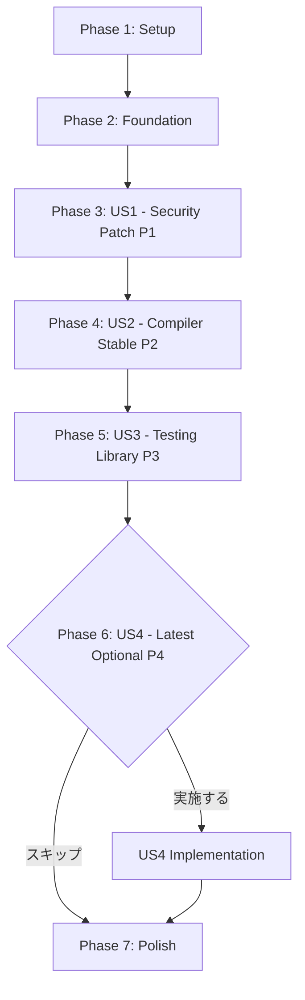

# Tasks: React 19セキュリティパッチ適用

**Input**: Design documents from `/specs/002-react-security-patch/`  
**Prerequisites**: plan.md, spec.md, research.md, data-model.md, contracts/, quickstart.md

**Tests**: テストタスクは仕様書で明示的に要求されていないため含まれていません。全ての品質ゲート（type-check, lint, test, build）は各フェーズの検証タスクで実行されます。

**Organization**: 本機能は依存関係更新のみで、ユーザーストーリー（P1-P4）がそれぞれ独立した実装フェーズに対応しています。各フェーズは独立してテスト可能で、Gitコミット単位でロールバック可能です。

## Format: `[ID] [P?] [Story] Description`

- **[P]**: 並列実行可能（異なるファイル、未完了タスクへの依存なし）
- **[Story]**: タスクが属するユーザーストーリー（US1, US2, US3, US4）
- ファイルパスを含む明確な説明

## Path Conventions

本プロジェクトは単一プロジェクト構造：
- **パッケージ管理**: `package.json`, `pnpm-lock.yaml` （ルートディレクトリ）
- **ソースコード**: `src/` （変更なし）
- **テスト**: `src/__tests__/`, `src/test/` （変更なし）

---

## Phase 1: Setup（共有インフラ）

**目的**: プロジェクト初期化と作業環境の準備

この機能では新しいプロジェクト構造の作成は不要です。既存のブランチと環境を確認します。

- [ ] T001 機能ブランチ `002-react-security-patch` がチェックアウトされていることを確認
- [ ] T002 現在のパッケージバージョンを記録（`pnpm list react react-dom babel-plugin-react-compiler @testing-library/react`）
- [ ] T003 未コミットの変更がないことを確認（`git status`）
- [ ] T004 現在のテストスイートがベースライン状態で成功することを確認（`pnpm test`）

---

## Phase 2: Foundational（ブロッキング前提条件）

**目的**: すべてのユーザーストーリー実装前に完了すべきコアインフラ

**⚠️ 重要**: このフェーズが完了するまで、ユーザーストーリー作業は開始できません

本機能では、既存のインフラがすでに整っているため、追加の基盤タスクは不要です。

**チェックポイント**: 基盤準備完了 - ユーザーストーリーの実装を並列開始可能

---

## Phase 3: User Story 1 - 重大な脆弱性の即座の解消 (Priority: P1) 🎯 MVP

**Goal**: React 19.1.4へ更新し、CVE-2025-55182（CVSS 10.0）、CVE-2025-55184（CVSS 7.5）、CVE-2025-55183（CVSS 5.3）の3つの重大な脆弱性を解消する

**Independent Test**: React 19.1.4へのアップグレード後、全ての品質ゲート（type-check, lint, test, build）が100%合格し、Tauriアプリケーションが正常に起動・動作することで検証可能

### Implementation for User Story 1

- [ ] T005 [US1] package.jsonのreactを19.1.4に更新（`pnpm add react@19.1.4`）
- [ ] T006 [US1] package.jsonのreact-domを19.1.4に更新（`pnpm add react-dom@19.1.4`）
- [ ] T007 [P] [US1] package.jsonの@types/reactを19.2.7に更新（`pnpm add -D @types/react@19.2.7`）
- [ ] T008 [P] [US1] package.jsonの@types/react-domを最新互換版に更新（`pnpm add -D @types/react-dom@19.1.19`）
- [ ] T009 [US1] pnpm-lock.yamlの変更を確認（`git diff pnpm-lock.yaml`でreact@19.1.4が含まれることを確認）
- [ ] T010 [US1] TypeScript型チェックを実行（`pnpm type-check`）し、エラーがないことを確認
- [ ] T011 [US1] Biome lintを実行（`pnpm lint`）し、エラーがないことを確認
- [ ] T012 [US1] 全テストを実行（`pnpm test`）し、100%合格することを確認
- [ ] T013 [US1] プロジェクトをビルド（`pnpm build`）し、成功することを確認
- [ ] T014 [US1] Tauri開発モードで手動テスト（`pnpm tauri dev`）：アプリ起動、フォルダ選択、画像表示、キーボードナビゲーション、テーマ切り替えを確認
- [ ] T015 [US1] package.jsonとpnpm-lock.yamlをGitにコミット（Conventional Commits形式: `feat: React 19.1.4へ更新（セキュリティパッチ）`、変更内容と検証結果を含む日本語メッセージ）
- [ ] T016 [US1] セキュリティ監査を実行（`pnpm audit`）し、React関連のCVE-2025-55182、CVE-2025-55184、CVE-2025-55183が報告されないことを確認

**チェックポイント**: この時点で、User Story 1は完全に機能し、独立してテスト可能です。セキュリティ脆弱性が解消され、アプリケーションは安全に動作します。

---

## Phase 4: User Story 2 - React Compiler安定版への移行 (Priority: P2)

**Goal**: React Compiler RC版（19.1.0-rc.3）から安定版（1.0.0）へ移行し、長期的なメンテナンス性とReact 19.1.4との互換性を確保する

**Independent Test**: babel-plugin-react-compiler 1.0.0への更新後、React開発者ツールで自動最適化が動作し、パフォーマンステストでPhase 1からの±5%以内の維持を検証可能

### Implementation for User Story 2

- [ ] T017 [US2] package.jsonのbabel-plugin-react-compilerを1.0.0に更新（`pnpm add -D babel-plugin-react-compiler@1.0.0`）
- [ ] T018 [US2] pnpm-lock.yamlの変更を確認（`git diff pnpm-lock.yaml`）
- [ ] T019 [US2] TypeScript型チェックを実行（`pnpm type-check`）し、エラーがないことを確認
- [ ] T020 [US2] 全テストを実行（`pnpm test`）し、100%合格することを確認
- [ ] T021 [US2] プロジェクトをビルド（`pnpm build`）し、成功することを確認、React Compilerの最適化警告がないか確認
- [ ] T022 [US2] Tauri開発モードで手動テスト（`pnpm tauri dev`）：画像切り替えパフォーマンス、フォルダナビゲーションのスムーズさを確認
- [ ] T023 [US2] React DevTools Profilerでパフォーマンス測定：Phase 1のベースラインと比較し±5%以内であることを確認
- [ ] T024 [US2] package.jsonとpnpm-lock.yamlをGitにコミット（Conventional Commits形式: `feat: React Compilerを1.0.0安定版へ更新`、変更内容とパフォーマンス検証結果を含む日本語メッセージ）

**チェックポイント**: この時点で、User Story 2は完全に機能し、独立してテスト可能です。React Compilerの安定版が動作し、自動最適化が維持されています。

---

## Phase 5: User Story 3 - テストライブラリの最新化 (Priority: P3)

**Goal**: テスト環境を最新の安定版に更新し、React 19.1.4との互換性を最大化する

**Independent Test**: @testing-library/react 16.3.1への更新後、全ての既存テストを再実行し、モック動作（src/test/mocks.ts）を含めて100%合格することで検証可能

### Implementation for User Story 3

- [ ] T025 [US3] package.jsonの@testing-library/reactを16.3.1に更新（`pnpm add -D @testing-library/react@16.3.1`）
- [ ] T026 [US3] pnpm-lock.yamlの変更を確認（`git diff pnpm-lock.yaml`）
- [ ] T027 [US3] 全テストを実行（`pnpm test`）し、100%合格することを確認、Testing LibraryのAPI変更による失敗がないか特に注意
- [ ] T028 [US3] src/test/mocks.tsのモック動作を確認するテストを実行（`pnpm test src/__tests__/App.test.tsx`）
- [ ] T029 [US3] Biome lintを実行（`pnpm lint`）し、エラーがないことを確認
- [ ] T030 [US3] package.jsonとpnpm-lock.yamlをGitにコミット（Conventional Commits形式: `chore: @testing-library/reactを16.3.1に更新`、変更内容とテスト結果を含む日本語メッセージ）

**チェックポイント**: この時点で、User Story 3は完全に機能し、独立してテスト可能です。テスト環境が最新化され、React 19との互換性が最大化されました。

---

## Phase 6: User Story 4 - 最新安定版への移行（オプション） (Priority: P4)

**Goal**: React 19.2.3への移行を検討し、新機能やさらなる改善の恩恵を受ける（オプショナル）

**Independent Test**: React 19.2.3への更新後、P1と同様の完全な品質ゲートを実行し、新機能の動作確認を行うことで検証可能

**注意**: このフェーズはオプションです。P1-P3が全て成功し、プロジェクトに余裕がある場合にのみ実施してください。

### Decision Point for User Story 4

- [ ] T031 [US4] React 19.2.3の変更履歴を確認（https://github.com/facebook/react/releases）
- [ ] T032 [US4] プロジェクトに有益な新機能があるか評価し、US4実施の判断を行う

### Implementation for User Story 4（実施を決定した場合のみ）

- [ ] T033 [US4] package.jsonのreactを19.2.3に更新（`pnpm add react@19.2.3`）
- [ ] T034 [US4] package.jsonのreact-domを19.2.3に更新（`pnpm add react-dom@19.2.3`）
- [ ] T035 [P] [US4] package.jsonの@types/reactを最新互換版に更新（`pnpm add -D @types/react@latest`）
- [ ] T036 [P] [US4] package.jsonの@types/react-domを最新互換版に更新（`pnpm add -D @types/react-dom@latest`）
- [ ] T037 [US4] pnpm-lock.yamlの変更を確認（`git diff pnpm-lock.yaml`）
- [ ] T038 [US4] TypeScript型チェックを実行（`pnpm type-check`）し、エラーがないことを確認
- [ ] T039 [US4] Biome lintを実行（`pnpm lint`）し、エラーがないことを確認
- [ ] T040 [US4] 全テストを実行（`pnpm test`）し、100%合格することを確認
- [ ] T041 [US4] プロジェクトをビルド（`pnpm build`）し、成功することを確認
- [ ] T042 [US4] Tauri開発モードで手動テスト（`pnpm tauri dev`）：全機能を確認
- [ ] T043 [US4] package.jsonとpnpm-lock.yamlをGitにコミット（Conventional Commits形式: `feat: React 19.2.3（最新安定版）へ更新`、変更内容と検証結果を含む日本語メッセージ）

**チェックポイント**: この時点で、User Story 4は完全に機能し、独立してテスト可能です（実施を決定した場合）。最新の安定版機能が適用されました。

---

## Phase 7: Polish & Cross-Cutting Concerns

**目的**: 全フェーズ完了後の最終確認とドキュメント更新

- [ ] T044 全フェーズの最終バージョン確認（`pnpm list react react-dom babel-plugin-react-compiler @testing-library/react`）
- [ ] T045 全品質ゲートの最終実行（`pnpm type-check && pnpm lint && pnpm test && pnpm build`）
- [ ] T046 最終セキュリティ監査（`pnpm audit`）でReact関連のCVEが報告されないことを確認
- [ ] T047 .github/copilot-instructions.mdのActive Technologiesセクションを最終更新（実施したフェーズの情報を反映）
- [ ] T048 プルリクエスト作成準備：変更内容のサマリー作成、レビューポイントの明確化
- [ ] T049 README.mdまたはCHANGELOG.mdへの変更履歴追加（オプション）

**チェックポイント**: すべてのタスクが完了し、機能はマージ可能な状態です。

---

## Dependencies & Execution Strategy

### User Story Completion Order



### Critical Path

1. **Phase 1 (Setup)** → 必須
2. **Phase 2 (Foundation)** → 必須（ただし本機能では実質的なタスクなし）
3. **Phase 3 (US1)** → 必須（セキュリティパッチ）
4. **Phase 4 (US2)** → 推奨（React Compiler安定版）
5. **Phase 5 (US3)** → 推奨（テストライブラリ更新）
6. **Phase 6 (US4)** → オプション（最新安定版）
7. **Phase 7 (Polish)** → 必須

### Parallel Execution Opportunities

**Phase 3 (US1) 内の並列実行**:
- T007（@types/react更新）と T008（@types/react-dom更新）は並列実行可能

**Phase 6 (US4) 内の並列実行**（実施する場合）:
- T035（@types/react更新）と T036（@types/react-dom更新）は並列実行可能

**重要**: 各フェーズは順次実行が必要です。前のフェーズが完了し、Gitにコミットされた後に次のフェーズを開始してください。

---

## Implementation Strategy

### MVP Scope (Minimum Viable Product)

**MVP = Phase 3 (User Story 1) のみ**

最小限の実装では、US1（セキュリティパッチ）のみを実施します：
- React 19.1.4へのアップグレード
- 型定義の更新
- 全品質ゲートの検証
- セキュリティ脆弱性の解消確認

これにより、最も重要なセキュリティリスクが即座に解消されます。

### Incremental Delivery

各ユーザーストーリーは独立した価値を提供します：

1. **US1 (P1)**: セキュリティ脆弱性解消 → 即座に本番デプロイ可能
2. **US2 (P2)**: React Compiler安定版 → 長期メンテナンス性向上
3. **US3 (P3)**: テストライブラリ更新 → テスト環境の安定性向上
4. **US4 (P4)**: 最新安定版 → 最新機能の恩恵（オプション）

各フェーズ後にGitコミットを行い、いつでもロールバック可能な状態を維持します。

---

## Rollback Strategy

各フェーズで問題が発生した場合のロールバック手順：

### 単一フェーズのロールバック

```bash
# 最後のコミットを取り消す
git revert HEAD
pnpm install
pnpm test
```

### 特定フェーズへのロールバック

```bash
# 例: Phase 4を取り消し、Phase 3の状態に戻る
git log --oneline  # Phase 4のコミットハッシュを確認
git revert <phase-4-commit-hash>
pnpm install
pnpm test
```

### 全フェーズのロールバック

```bash
# すべての変更を取り消す
git reset --hard origin/main
pnpm install
pnpm test
```

---

## Success Criteria Verification

各フェーズ完了時に以下を確認：

- [ ] 全品質ゲート100%合格（type-check, lint, test, build）
- [ ] Gitコミットが作成され、ロールバック可能
- [ ] 手動テストで主要機能が正常動作
- [ ] セキュリティ監査でCVEが報告されない（US1完了後）
- [ ] パフォーマンスがベースライン±5%以内（US2完了後）

最終的な成功基準（全フェーズ完了時）：

- [ ] SC-001: CVE-2025-55182、CVE-2025-55184、CVE-2025-55183が解消
- [ ] SC-002: 全フェーズで品質ゲート100%合格
- [ ] SC-003: Tauriアプリケーションの全機能が正常動作
- [ ] SC-004: React Compiler最適化が維持（±5%以内）
- [ ] SC-005: 各フェーズでGitコミット、ロールバック可能
- [ ] SC-006: 全体で2-4時間以内に完了

---

## Task Summary

**Total Tasks**: 49タスク

**Task Count per User Story**:
- Setup (Phase 1): 4タスク
- Foundation (Phase 2): 0タスク（既存インフラ利用）
- User Story 1 (Phase 3): 12タスク
- User Story 2 (Phase 4): 8タスク
- User Story 3 (Phase 5): 6タスク
- User Story 4 (Phase 6): 13タスク（オプション）
- Polish (Phase 7): 6タスク

**Parallel Opportunities**:
- Phase 3: 2タスク並列実行可能（型定義更新）
- Phase 6: 2タスク並列実行可能（型定義更新、実施する場合）

**Independent Test Criteria**:
- US1: 全品質ゲート合格、セキュリティ脆弱性解消、Tauriアプリ正常動作
- US2: パフォーマンス±5%以内、React Compiler最適化動作
- US3: 全テスト合格、モック動作確認
- US4: US1と同様の完全な品質ゲート（実施する場合）

**Suggested MVP Scope**: Phase 3（User Story 1）のみ実施 - セキュリティ脆弱性の即座の解消

---

## Format Validation

✅ **全タスクがチェックリスト形式に従っています**:
- チェックボックス: `- [ ]`
- タスクID: T001-T049（実行順）
- [P]マーカー: 並列実行可能なタスクに付与
- [Story]ラベル: ユーザーストーリーフェーズのタスクに付与（US1-US4）
- 説明: ファイルパスを含む明確なアクション

各タスクはLLMが追加コンテキストなしで完了できるよう具体的に記述されています。
